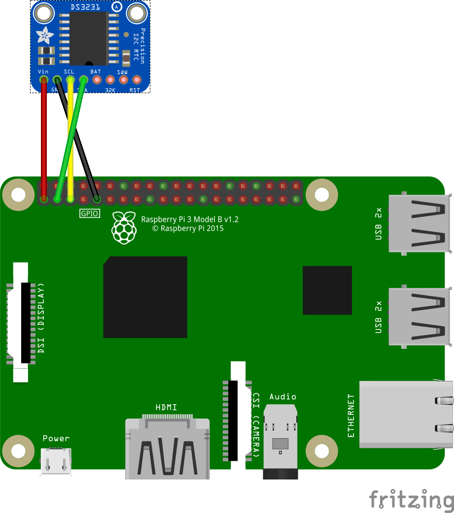

DS3231 RTC Driver for Android Things
=============================================

This driver supports the [DS3231][product_ds3231] RTC module.

The driver can be used to get and set date and time from a battery backed
DS3231 RTC module.

This package also contains a broadcast receiver that can be used to 
automatically restore the system time from the RTC on boot,
and save the system time to the RTC when it receives an update (NTP) from 
the network

How to use the driver
---------------------

### Gradle dependency

To use the `ds3231` driver, simply add the line below to your project's `build.gradle`,
where `<version>` matches the last version of the driver available on [jcenter][jcenter].

```
dependencies {
    implementation 'jpuderer.android.things.drivers:driver-ds3231:0.1'
    ...
}
```

### Sample usage

The simplest way to use the RTC is to include the following meta-data tag in your
application manifest, where the value corresponds to the I2C bus the RTC module
is attached to:
```
<meta-data android:name="rtc_i2c_device_name" android:value="I2C1" />
```

You can also access the sensor directly:
```java
import net.jpuderer.android.things.drivers.ds3231.Ds3231Rtc;

Ds3231Rtc mDs3231Rtc;
 
...

try {
    final String i2cDeviceName = "I2C1;
    mDs3231Rtc = new Ds3231Rtc(i2cDeviceName);
        
    LocalDateTime localDateTime = mDs3231Rtc.getUtcDateTime();
    long timestamp = mDs3231Rtc.getEpochTimeMillis();
            
    mDs3231Rtc.setUtcDateTime(localDateTime);
    mDs3231Rtc.setEpochTimeMillis(timestamp);
    
} catch (IOException e) {
    e.printStackTrace();
}

// Close the RTC when finished:
try {
    mDs3231Rtc.close();
} catch (IOException e) {
    // error closing sensor
}
```

### Connections

The following Fritzing diagram shows how the DS3231 modules in typically connected to a RPi3.




[product_ds3231]: https://learn.adafruit.com/adafruit-ds3231-precision-rtc-breakout
[jcenter]: https://bintray.com/jpuderer/jpuderer-things-drivers/jpuderer-things-driver-ds3231/_latestVersion

